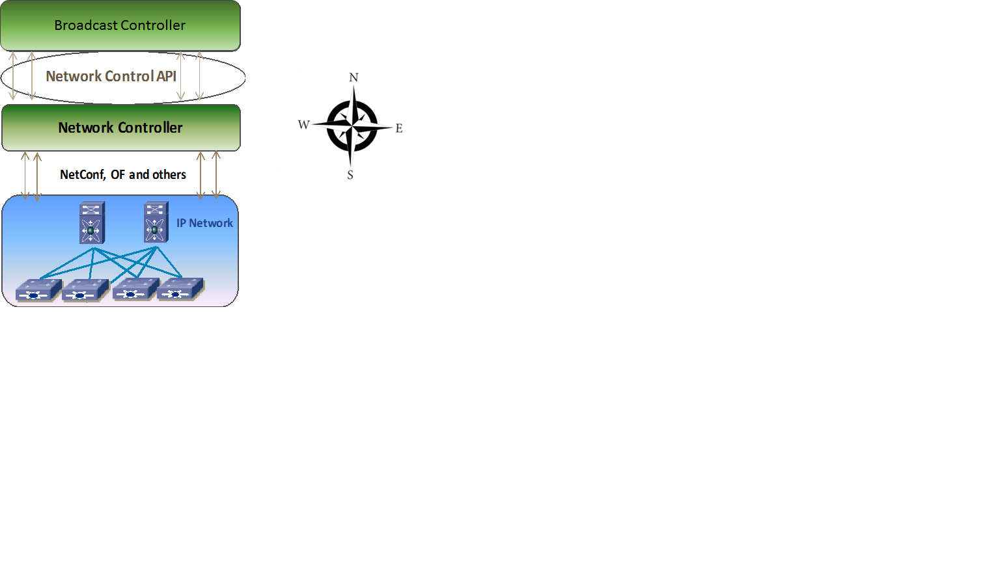

# AMWA IS-06 NMOS Network Control API Specification: Overview

_(c) AMWA 2017, CC Attribution-ShareAlike 4.0 International (CC BY-SA 4.0)_

## Documentation

The documents included in this directory provide details and recommendations for implementations of the defined APIs, or their consumers.

Familiarity with the JT-NM reference architecture (http://jt-nm.org/) is assumed.

## Introduction

The purpose of this document is to explain the AMWA IS-06 NMOS Network Control API. The API is between the broadcast controller and the network controller as shown in the figure below. The broadcast controller is the overall policy control point for all media endpoints and sessions. The network controller abstracts the details of the network from the broadcast controller and provides an API for all required network services.

The API is "Northbound" of the Network Controller. The purpose of this API is to:
* Discover network topology
* Create and modify media flows in the network from a sender to one or more receiver devices
* Control how flows move on the network
* Assure bandwidth for these media flows
* Ensure network security by only allowing authorized senders, receivers and flows.

## Data Model

The resources that are managed by AMWA IS-06 NMOS Network Control API are specified in the [Data Model](3.0.%20Data%20Model.md).

## Relationship with other Specifications

This specification has no dependency on AMWA IS-04 or IS-05. However the overall system is more fully automated with IS-04 and IS-05.

