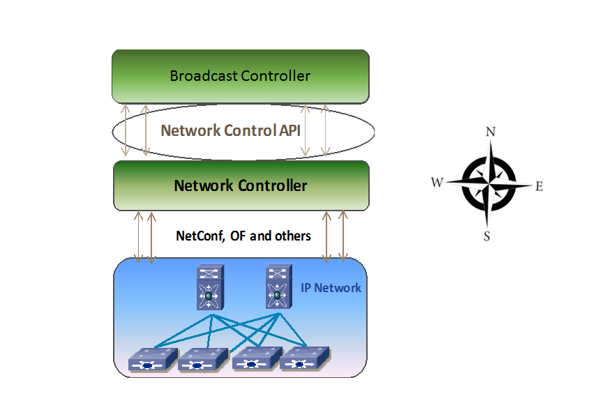
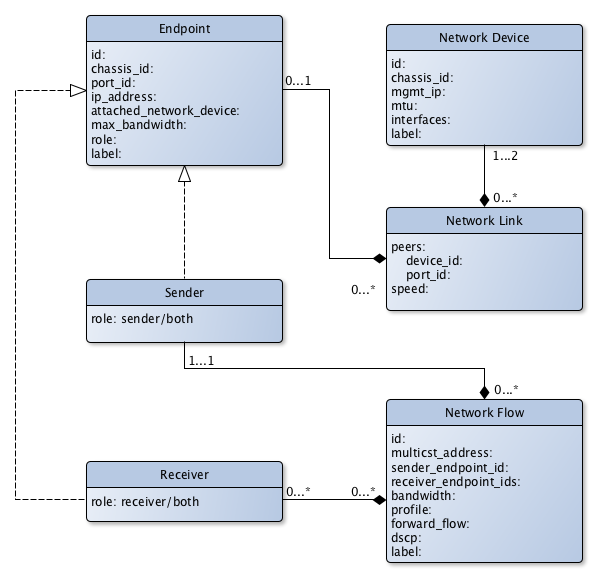

# AMWA NMOS Network Control API Specification: Overview

_(c) AMWA 2017, CC Attribution-ShareAlike 4.0 International (CC BY-SA 4.0)_

## Documentation

The documents included in this directory provide details and recommendations for implementations of the defined APIs, or their consumers.

Familiarity with the JT-NM reference architecture (http://jt-nm.org/) is assumed.

## Introduction

The purpose of this document is to explain the AMWA NMOS IS-06, the network control API. The API is between the broadcast controller and the network controller as shown in the figure below.  The broadcast controller is the overall policy control point for all media endpoints and sessions. The network controller abstracts the details of the network from the broadcast controller and provides an API for all required network services. 

The API is "Northbound” of Network Controller. The purpose of this API is:
* Discover network topology
* Create and modify media flows in the network from a sender to one or more receiver devices
* Control how flows move on the network
* Assure bandwidth for these media flows
* Ensure network security by only allowing authorized senders, receivers and flows.

The resources that is managed by the AMWA NMOS IS-06 API are as follows:
- Network devices
- Endpoints
- Links between the network switches or between the network switch and the endpoint
- Flows

 The broadcast controller is responsible for uniquely identifying the endpoint connected to the network to authorize it. The objective of the endpoint authorization is that no endpoint is allowed to send or receive any packet and no packet moves on the network without authorization. The broadcast controller tells the network controller through the API, which endpoint is allowed to send and which endpoint is allowed to receive. It also registers the flow, the flow bandwidth and the QoS tag to be used with the flow. More details regarding the flow can be found in the "Endpoints" file in the same directory. 

### Class diagram

N.B. This diagram was prepared using yEd (http://www.yworks.com/products/yed) free version. Copyright issues are not considered yet.
 

There can be multiple broadcast controllers managing a single network controller and likewise, there can be multiple network controllers managed by the same broadcast controller.  In the case of multiple broadcast controllers managing a single network controller,  this specification in its current phase, only supports the basic model. This means that there is no separation between the broadcast controllers. In other words, if a broadcast controller A, registers an endpoint SS, then a broadcast controller B can retrieve, modify and delete that endpoint SS. In future phases, logical separation of the broadcast controller and its devices plus the multi-tenancy models will be undertaken. Topics for the next phase can be found in the "Futures" file in the same directory.

