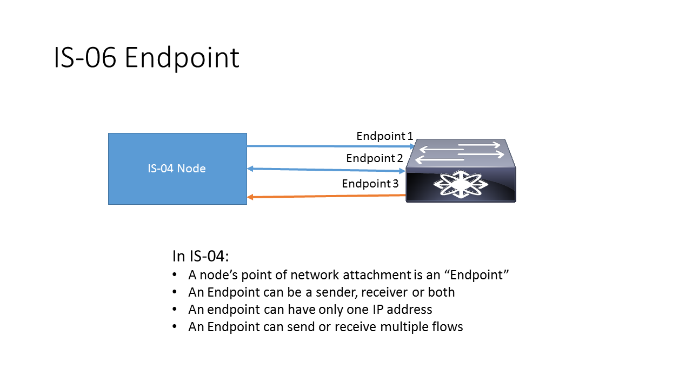
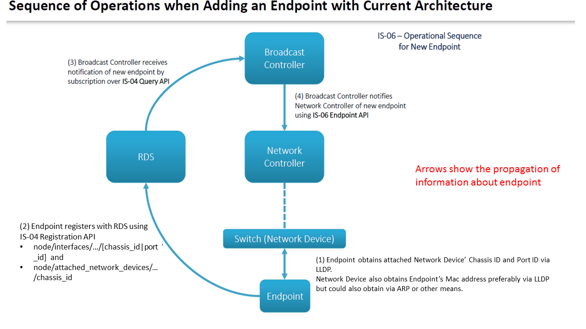

# Data Model: Endpoint

_(c) AMWA 2017, CC Attribution-ShareAlike 4.0 International (CC BY-SA 4.0)_

The Endpoint, in this context, equals a single connection of a host device to a [Network Device](3.3.%20Data%20Model%20-%20Network%20Device.md). Therefore, if a host device has multiple interfaces through which the flows are sent or received, then each of them will be classified as an "endpoint" as per this specification. The broadcast controller can register as many "endpoints" as there are interfaces on the host devices that are connected to the network devices to send and receive flows.

The endpoint has to be registered with the Network Controller before it can send and/or receive any flows. The Broadcast Controller will provide a unique identifier in the PUT request to register the endpoint. The Broadcast Controller may create this identifier by itself or it may be generated elsewhere in the system. This identifier uniquely identifies the endpoint within the network and is used on all subsequent endpoint-related operations.

The required parameters for registering the endpoint are:
* `id`: A unique identifier for this endpoint as explained above
* `chassis_id`: The endpoint shall provide its MAC address or any information permitted by the IEEE Link Layer Discovery Protocol (LLDP) for the Chassis ID parameter
* `port_id`: The endpoint shall provide its MAC address as permitted by LLDP for this parameter
* `ip_address`: The endpoint's IP address that will be used to send and/or receive the flows
* `attached_network_device`: The switch's MAC address and its ethernet information which are provided by the switch in the LLDP's mandatory Chassis ID and MAC ID parameters

The operations allowed on an Endpoint are GET, PUT, PATCH and DELETE. GET is to retrieve an endpoint using the unique identifier. PUT is to create or register a new endpoint. PATCH is for modification of an endpoint. Only certain fields can be modified as explained in the API schema.
