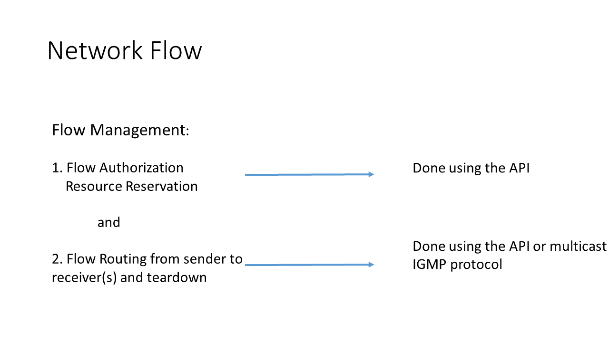

# Data Model: Network Flow

_(c) AMWA 2017, CC Attribution-ShareAlike 4.0 International (CC BY-SA 4.0)_

In the AMWA IS-06 data model, the terms "flow" refers to a "Network Flow", that is, the "networked stream" as defined in JT-NM. It is not the same as the "flow" described in AMWA IS-04. A key function of this specification is network flow management, which includes flow creation, flow modification, and flow deletion.
In AMWA IS-06, a flow is identified and used in the operations using a GUID which is generated or provided by the Broadcast Controller. A network flow, identified by flow id, is equivalent to the sender id and the multicast address, or the <S,G> pair. The sender id represents a unique sender endpoint. A sender endpoint can send more than one flow. Likewise, multiple senders may send to the same multicast address. In this data model, the sender together with the multicast address must be unique and equals a flow. Therefore, neither the sender id nor the multicast address can be updated for an existing flow. A new network flow should be created for a different pair of <S,G>.

The required parameters of a Network Flow are:

* `id`: uniquely identifies a flow
* `multicast_address`: The multicast group address the flow is sent to
* `sender_endpoint_id`: The sender who is sending the flow into the flow
* `receiver_endpoint_ids`: The receiver node or endpoint receiving the flow
* `bandwidth`: The average rate of the flow

There can be zero or more receivers when the flow is created. If the flow is created with zero receivers, then the network does not do any bandwidth management until the receiver is known. A receiver can be added, updated or deleted by using the /receivers PUT, POST or DELETE requests. The flow can also be created with multiple receivers, in which case, the network does an admission control and bandwidth management to transmit the flow to all the named receivers.

The profile of the flow is another parameter which helps the network in making admission control decisions. As the bandwidth value represents only an average rate of the flow, it does not provide a maximum value for the network to do admission control or to provision the flow with guarantees. The profile of the flow is an addition information which tells the network how much the flow is expected to burst. In constant rate, the average rate is also the max rate of the flow. The SMPTE ST 2110 wide profile, on the other hand, permits a flow to go over the average rate. It is left to implementation of how a network controller and network interprets the profile and bandwidth value to make an admission control decision.

The operations that are permitted on a flow are GET, PUT, PATCH, and DELETE.

One of the other parameters is `forward_flow`. This tells the network controller whether the flow should be transmitted to the receivers at this time. If `forward_flow` is `true`, then the network controller and network will do bandwidth management and forward the flow to the listed receivers. If `forward_flow` is `false` and receivers are listed, then subsequently, the broadcast controller should either make a flow request with `forward_flow` set to `true` or the receiver should make an IGMP JOIN request to get the flow.

If a receiver makes an IGMP JOIN request without being listed in the PUT request or being added by the /receivers PUT or POST request, then its IGMP join must be rejected. This is because the API also provides the authorization of the flow to the specific sender, multicast address and the receiver(s). This protects the network resource for valid use. If such an IGMP JOIN request is not rejected, it opens a security hole for any unauthorized endpoint to request and receive a flow to which it is not entitled to.

As you can see above, IS-06 permits a full API operation or a combination of API and IGMP operation for flow management. In the combined method, the API is used for endpoint and flow authorization where the transmitting of the flow from the sender to the receiver is based on the direct request by the receiver using the IGMP protocol. The teardown can be done by either as well.
