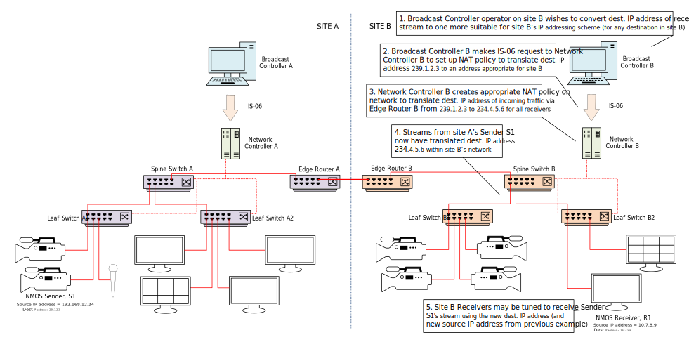

# Data Model: Network Address Translation

_(c) AMWA 2020, CC Attribution-ShareAlike 4.0 International (CC BY-SA 4.0)_

A Network Address Translation policy represents a simple NAT policy for IP Addresses and/or Ports, to be applied by the network controller to the appropriate [Network Devices](3.3.%20Data%20Model%20-%20Network%20Device.md).

The parameters of a Network Address Translation policy are:

* `id`: uniquely identifies a network address translation policy
* `label`: an optional human-readable name for the policy
* `match`: one or more of the `source_ip`, `source_port`, `destination_ip`, `destination_port` values that must be matched for the policy to be applied. If a Port is specified, the corresponding IP address must also be specified.
* `translated`: one or more of the `source_ip`, `source_port`, `destination_ip`, `destination_port` values that will be applied if the `match` conditions are met
* `receiver_endpoint_ids`: the receiver endpoints for which the policy should be applied (or any receiver if the array is empty)

The operations that are permitted on a Network Address Translation policy are GET, PUT, PATCH, and DELETE.

When a network controller does not support the network address translation functionality, the response to all operations must be 501 Not Implemented.

## NAT Examples

The following diagrams demonstrate some use cases for simple NAT policies.

### Supporting non-NMOS devices with fixed multicast addresses

One of the motivating use cases for IS-06 NAT policies is to flexibly support devices which are set to fixed multicast addresses. Examples of such devices include contribution encoders and decoders, network monitoring / packet capture equipment or any other device tuned to a specific multicast address which cannot be changed using the NMOS Connection API.

The figure shows how a Broadcast Controller operator who wishes a non-NMOS Receiver tuned to a fixed destination IP address to receive a stream may use a NAT-aware IS-06 network controller to achieve this.


The Broadcast Controller allocates a unique `policyId` for the NAT policy, and makes a PUT request to the /network-address-translations/{policyId} resource, with a JSON request body describing the destination IP address to be matched, the translated address, and the receiver endpoint ID of the non-NMOS Receiver, which must be already registered as an [Endpoint](3.1.%20Data%20Model%20-%20Endpoint.md).

```json
{
  "id": "6b397632-d8af-4116-ad34-39ae9cc2806e",
  "label": "NAT S1-R2",
  "match": {
    "destination_ip": "239.1.2.3"
  },
  "translated": {
    "destination_ip": "235.7.8.9"
  },
  "receiver_endpoint_ids": [
    "8268e254-e054-409b-b4ab-65ee18ae684d"
  ]
}
```

Note that for network monitoring / packet capture equipment, additional IS-06 NAT policies could be set up to support redirecting all network flows to the equipment (one for each flow on the network).

### Supporting non-NMOS devices with fixed multicast addresses and UDP ports

Another use case for IS-06 NAT policies is to support devices that are tuned to a specific multicast address and UDP port which cannot be changed using the NMOS Connection API. In some of these cases, the same multicast address but different UDP ports might be used for different streams, for example for video and FEC as described in SMPTE ST 2022-5.

The figure shows how a Broadcast Controller operator who now wishes a non-NMOS Receiver tuned to specific IP address and UDP ports to receive two such streams may use a NAT-aware IS-06 network controller to achieve this.


The Broadcast Controller makes a first PUT request to create a NAT policy resource for the video stream, with a JSON request body describing the destination IP address and first port to be matched, the translated address details, and the receiver endpoint ID of the non-NMOS Receiver.

```json
{
  "id": "b46fa060-a5fe-4144-94dc-24d5041c9f10",
  "label": "NAT S1-R3-video",
  "match": {
    "destination_ip": "239.1.2.3",
    "destination_port": 4500
  },
  "translated": {
    "destination_ip": "235.7.8.9",
    "destination_port": 10500
  },
  "receiver_endpoint_ids": [
    "b4aa4549-ef19-460b-9c93-76b41457af48"
  ]
}
```

The Broadcast Controller then makes a second PUT request to create another NAT policy resource for the FEC data, with a JSON request body describing the same destination IP address but the second port to be matched, along with the translated address details and the receiver endpoint ID of the non-NMOS Receiver.

```json
{
  "id": "4e8ff5ab-4c74-464c-8073-3d5a7f886041",
  "label": "NAT S1-R3-fec",
  "match": {
    "destination_ip": "239.1.2.3",
    "destination_port": 4510
  },
  "translated": {
    "destination_ip": "235.7.8.9",
    "destination_port": 10510
  },
  "receiver_endpoint_ids": [
    "b4aa4549-ef19-460b-9c93-76b41457af48"
  ]
}
```

### Supporting sharing of resources between networks

A third use case for IS-06 NAT policies is to support sharing of resources between networks. These might be on different sites and managed by different controllers. In such cases, the operator of the first network may wish to share resources without revealing private networking information to the second network such as source IP addresses. Additionally, the second network may have a different multicast addressing scheme to the first network, and so need to change the destination IP addresses of any incoming streams.

The two figures below show how the use of NAT-aware network controllers may be used to achieve these requirements.

The first figure shows how the Broadcast Controller operator of the first site, who wishes to make a resource available to a second site but not reveal private source IP addressing information may use a NAT-aware IS-06 network controller on the first site to achieve this.


The Broadcast Controller makes as many PUT requests as necessary to create a NAT policy for each source IP address to be translated, using the receiver endpoint ID of the edge router.

```json
{
  "id": "19abd553-af19-4a20-b299-146c5634b813",
  "label": "NAT S1-outgoing",
  "match": {
    "source_ip": "192.168.12.34"
  },
  "translated": {
    "source_ip": "10.7.8.9"
  },
  "receiver_endpoint_ids": [
    "8cb36d14-a8bf-4608-ae50-5f3acd68b8b0"
  ]
}
```

The second figure shows how the Broadcast Controller operator of the second site who, on receiving a stream from the first site, wishes to modify its destination IP address to make it more suitable for the second site's multicast IP addressing scheme, may use a NAT-aware IS-06 network controller on the second site to achieve this.



The Broadcast Controller makes as many PUT requests as necessary to create a NAT policy for each destination IP address to be translated. In this case, no receiver endpoint ID is specified so that the policy is applied to the incoming stream for all end devices (i.e. it is applied at the ingress port of Spine switch B that it attached to Edge Router B).

```json
{
  "id": "7e565b85-5efd-40c5-9929-05c13c19d14b",
  "label": "NAT S1-incoming",
  "match": {
    "destination_ip": "239.1.2.3"
  },
  "translated": {
    "destination_ip": "234.4.5.6"
  },
  "receiver_endpoint_ids": [
  ]
}
```


