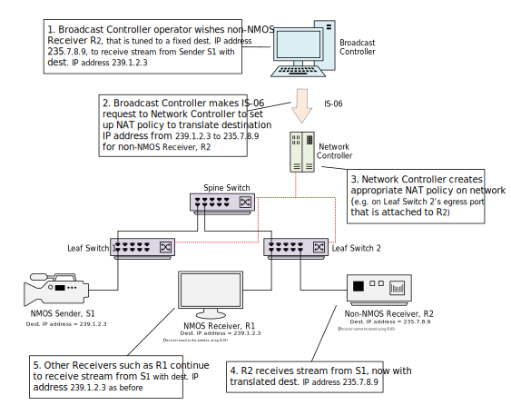
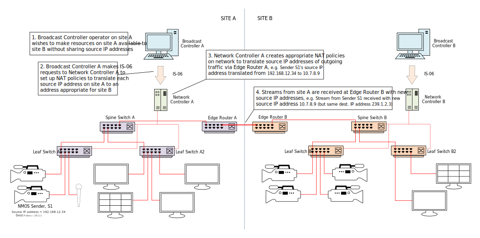

# Data Model: Network Address Translation

_(c) AMWA 2020, CC Attribution-ShareAlike 4.0 International (CC BY-SA 4.0)_

A Network Address Translation policy represents a simple NAT policy for IP Addresses and/or Ports, to be applied by the network controller to the appropriate [Network Devices](3.3.%20Data%20Model%20-%20Network%20Device.md).

The parameters of a Network Address Translation policy are:

* `id`: uniquely identifies a network address translation policy
* `label`: an optional human-readable name for the policy
* `match`: optionally, one or more of the `source_ip`, `source_port`, `destination_ip`, `destination_port` values that must be matched for the policy to be applied
* `translated`: one or more of the `source_ip`, `source_port`, `destination_ip`, `destination_port` values that will be applied if the `match` conditions are met
* `receiver_endpoint_ids`: the receiver endpoints for which the policy should be applied (or any receiver if the array is empty)

The operations that are permitted on a Network Address Translation policy are GET, PUT, PATCH, and DELETE.

When a network controller does not support the network address translation functionality, the response to all operations must be 501 Not Implemented.

## NAT Examples

The following diagrams demonstrate some use cases for simple NAT policies.

### Supporting non-NMOS devices with fixed multicast addresses

One of the motivating use cases for IS-06 NAT policies is to flexibly support contribution encoders and decoders which are set to fixed multicast addresses.

The figure shows how a Broadcast Controller operator who wishes a non-NMOS Receiver tuned to a fixed destination IP address to receive a stream may use a NAT-aware IS-06 network controller to achieve this.



The Broadcast Controller allocates a unique `policyId` for the NAT policy, and makes a PUT request to the /network-address-translations/{policyId} resource, with a JSON request body describing the destination IP address to be matched, the translated address, and the receiver endpoint ID of the non-NMOS Receiver, which must be already registered as an [Endpoint](3.1.%20Data%20Model%20-%20Endpoint.md).

```json
{
  "id": "6b397632-d8af-4116-ad34-39ae9cc2806e",
  "label": "NAT S1-R2",
  "match": {
    "destination_ip": "239.1.2.3"
  },
  "translated": {
    "destination_ip": "235.7.8.9"
  },
  "receiver_endpoint_ids": [
    "8268e254-e054-409b-b4ab-65ee18ae684d"
  ]
}
```

### Supporting non-NMOS devices with different control protocols

Another use case for IS-06 NAT policies is to support devices that are tuned to a specific multicast address which cannot be changed using the NMOS Connection API.

The figure shows how a Broadcast Controller operator who now wishes a non-NMOS Receiver tuned to specific IP address details to receive a stream may use a NAT-aware IS-06 network controller to achieve this.


The Broadcast Controller makes a PUT request to create another NAT policy resource, with a JSON request body describing the destination IP address and port to be matched, the translated address details, and the receiver endpoint ID of the non-NMOS Receiver.

```json
{
  "id": "b46fa060-a5fe-4144-94dc-24d5041c9f10",
  "label": "NAT S1-R3",
  "match": {
    "destination_ip": "239.1.2.3",
    "destination_port": 4500
  },
  "translated": {
    "destination_ip": "238.7.6.5",
    "destination_port": 50000,
    "source_ip": "192.168.7.6",
    "source_port": 3000 
  },
  "receiver_endpoint_ids": [
    "b4aa4549-ef19-460b-9c93-76b41457af48"
  ]
}
```

### Supporting network monitoring equipment

Another possible use case for IS-06 NAT policies is to support redirecting network flows to general network monitoring / packet capture equipment.

The figure shows how a Broadcast Controller operator who wishes a particular Receiver to receive all streams for monitoring purposes may use a NAT-aware IS-06 network controller to achieve this.



The Broadcast Controller makes a PUT request to createa NAT policy resource, with a JSON request body describing the translated address details, and the receiver endpoint ID of the non-NMOS Receiver. No match parameters are specified.

```json
{
  "id": "69461e17-862d-4c05-a927-f1b6f6b3bc26",
  "label": "NAT R4",
  "translated": {
    "destination_ip": "234.0.0.1"
  },
  "receiver_endpoint_ids": [
    "1d27bd5a-6eae-4139-9abd-ed8539d63787"
  ]
}
```


### Supporting sharing of resources between networks managed by different controllers

A fourth possible use case for IS-06 NAT policies is to support sharing of resources between networks managed by different controllers.

The figure shows how a Broadcast Controller operator who wishes to make resource in one site available to another site which has a different multicat IP addressing scheme may use a NAT-aware IS-06 network controller to achieve this.


The Broadcast Controller makes as many PUT requests as necessary to create a NAT policy for each destination IP address to be translated, using the receiver endpoint ID of the edge router.

```json
{
  "id": "19abd553-af19-4a20-b299-146c5634b813",
  "label": "NAT S1",
  "match": {
    "destination_ip": "239.1.2.3"
  },
  "translated": {
    "destination_ip": "234.0.0.1"
  },
  "receiver_endpoint_ids": [
    "8cb36d14-a8bf-4608-ae50-5f3acd68b8b0"
  ]
}
```

