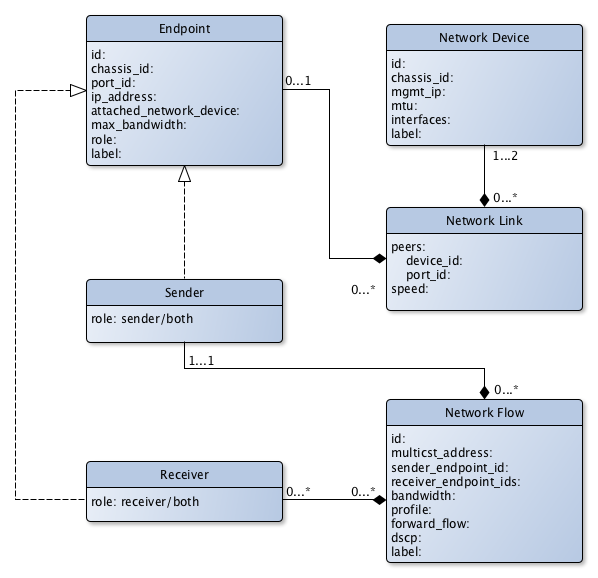

# Data Model

_(c) AMWA 2017, CC Attribution-NoDerivatives 4.0 International (CC BY-ND 4.0)_

The resources that are managed by the Network Control API are as follows:
- [Network Devices](Data%20Model%20-%20Network%20Device.md) (switches) 
- [Endpoints](Data%20Model%20-%20Endpoint.md)
- [Network Links](Data%20Model%20-%20Network%20Link.md) between the network switches or between a network switch and an endpoint
- [Network Flows](Data%20Model%20-%20Network%20Flow.md)

The broadcast controller is responsible for uniquely identifying the endpoint connected to the network to authorize it. The objective of the endpoint authorization is that no endpoint is allowed to send or receive any packet and no packet moves on the network without authorization. The broadcast controller tells the network controller through the API, which endpoint is allowed to send and which endpoint is allowed to receive. It also registers the flow, the flow bandwidth and the DSCP-based QoS tag to be used with the flow. More details can be found in the following sections.

There can be multiple broadcast controllers managing a single network controller and likewise, there can be multiple network controllers managed by the same broadcast controller. In the case of multiple broadcast controllers managing a single network controller, this specification, only supports the basic model. This means that there is no separation between the broadcast controllers. In other words, if a broadcast controller A registers an endpoint SS, then a broadcast controller B can retrieve, modify and delete that endpoint SS.

## Identifier Persistence & Generation

Persistent identity helps to ensure that users' expectations meet with reality. For example, if a network device is switched off and back on, the user would expect it to return with the same configuration. This can only be managed if the identifiers used by the network controller and its clients remain the same.

UUIDs are used throughout the data model, and can be generated in a number of ways (including from hardware addresses) in order to achieve consistent behaviour (see [RFC 4122](https://tools.ietf.org/html/rfc4122)).
 
### Endpoint

The client registering the Endpoint is responsible for providing a persistent, unique `id`.
If the client does not have a suitable value, the `chassis_id`, `port_id` and `ip_address` parameters together may be used to generate one.

Note that if there are multiple IP addresses associated with a single physical endpoint then it must be modelled as multiple virtual endpoints each with a unique IP address.

### Network Flow

The client registering the Network Flow is responsible for providing a persistent, unique `id`.
If the client does not have a suitable value, the `multicast_address` and `sender_endpoint_id` parameters together may be used to generate one.

### Network Device

The network controller reporting the Network Device is responsible for providing a persistent, unique `id`.
If the network controller does not have a suitable value, the `chassis_id` parameter may be used to generate one.

### Network Link

The network controller reporting the Network Link is responsible for providing a persistent, unique `id`.
If the network controller does not have a suitable value, the `chassis_id` and `port_id` of the `peers` may be used to generate one.
