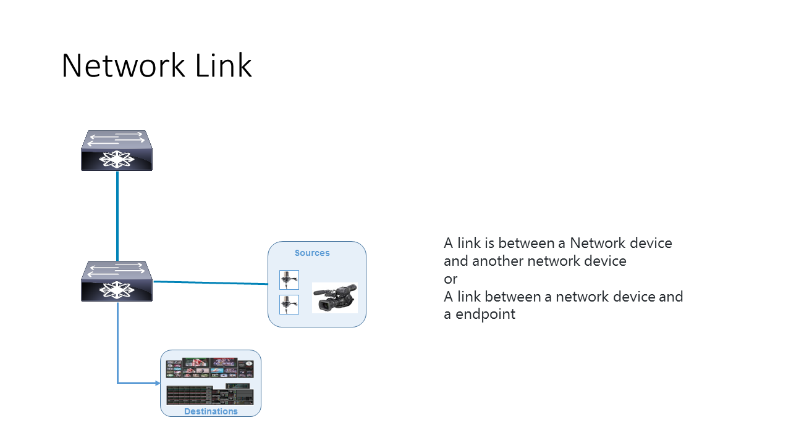

# AMWA NMOS Network Control API Specification: Network links

_(c) AMWA 2017, CC Attribution-ShareAlike 4.0 International (CC BY-SA 4.0)_

### Network Links 

Network-Link is the link between a Network device and another network device or the link between the network device and the endpoint. It is identified by Chassis id and Port id, both mandatory parameters included in Link Layer Discovery protocol (LLDP).   

In the case of the network device, the Chassis ID contains the MAC address and the Port ID contains the Ethernet Interface information. This information is the same as what the network device sends in its LLDP message.  In the case of an endpoint, the Port ID contains the MAC address. The Chassis ID may be null or any LLDP permitted types. This information is provided by the Broadcast Controller during Endpoint Registration process. 
The only operation permitted for this resource is GET. When a broadcast controller performs a GET by providing a network device ID, the network controller returns all the links that originate/terminate in the specified network device; the one that is connected to the endpoint and/or the one that it is connected to a neighboring switch. 
As these links are bi-directional, the same link information will be reported by both network devices when a GET operation is performed on both the neighboring network devices.

 
